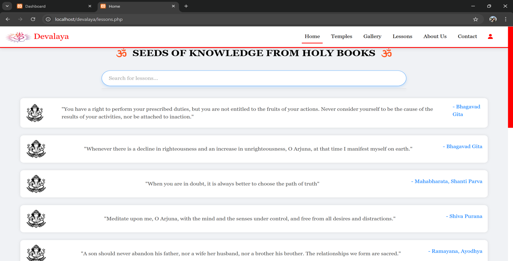
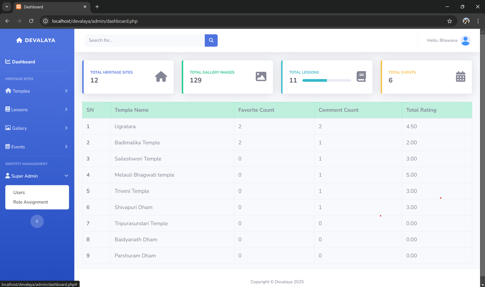
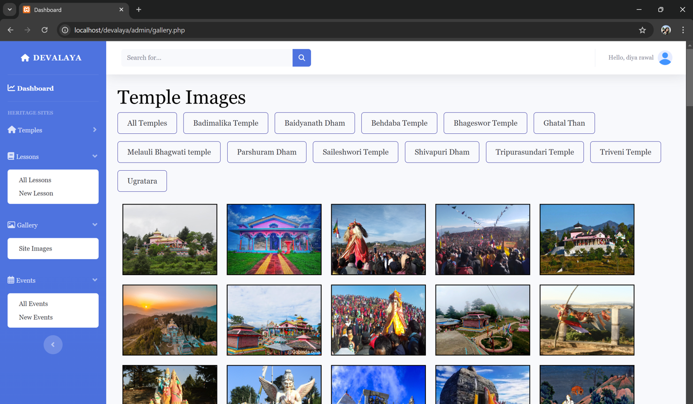

# Devalaya Explorer
> Devalaya Explorer is an informative portal dedicated to unveiling the spiritual and cultural treasures of far-west Nepal. Through vivid storytelling, stunning visuals, and interactive features, it invites everyone from spiritual seekers to cultural enthusiasts to explore and connect with the unique heritage of this sacred region. The platform combines detailed narratives with rich imagery, offering a modern way to discover the ancient wisdom and beauty of far-west Nepal. With features like user reviews and ratings, Devalaya Explorer creates a global connection to this lesser known yet profoundly significant cultural landscape.
# Snapshots
### Home Page

### Temple Sites

### Galleries

### Temple Details

### Ratings & Reviews

### Lessons Page

### Event Section

### About Us

### Contact Page

### Login Page

### Register Page

### Password Recover

### Reset Password

### Super Admin Panel

### Devalaya Users

### Role Assignment

### Admin Panel

### Insert Module

### View Module

### Edit Module

### Admin Galleries
